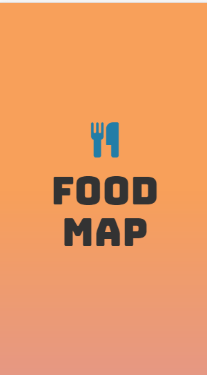

# FOODMAP

***

## Objetivos

Crea una web-app que a través de un input pueda filtrar los restaurantes que se encuentran cerca de ti (Tú decides la estructura que tendrán tus datos, puedes crear una lista de restaurantes en un arreglo, en un objeto, de manera individual. El diseño es totalmente libre).

## Flujo de la aplicación

  *Inicia con la vista de presentación.
  

