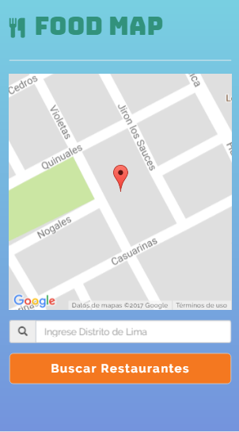
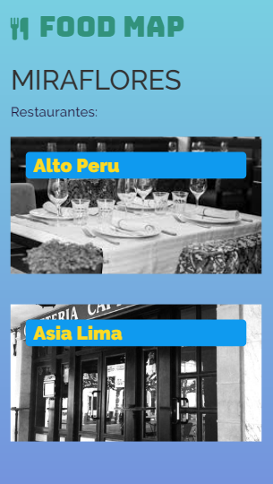
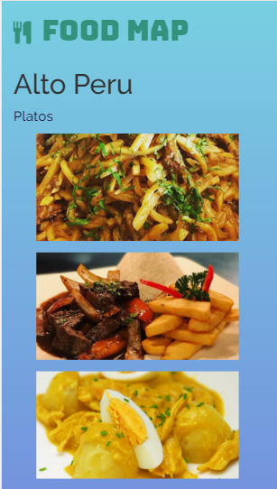
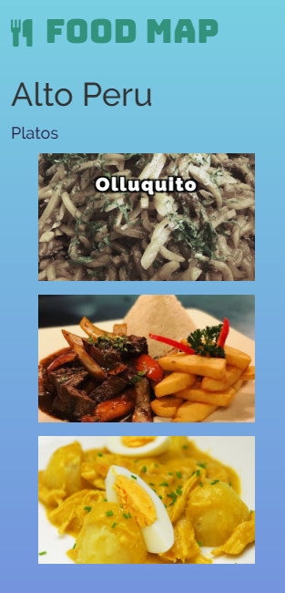
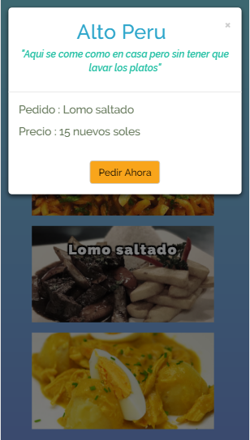

# FOODMAP

***

## Objetivos

Crea una web-app que a través de un input pueda filtrar los restaurantes que se encuentran cerca de ti (Tú decides la estructura que tendrán tus datos, puedes crear una lista de restaurantes en un arreglo, en un objeto, de manera individual. El diseño es totalmente libre).

## Flujo de la Aplicación

La app realizara una busqueda por distrito en este caso :Miraflores, Comas y Lince cada uno cuenta con dos restaurantes y a su vez estas presentaran tres platos.

- Inicia con la vista de presentación.

  

- Ingresar en que Distrito desea comer : Miraflores,Comas o Lince.

  

- En esta vista se presenta los dos restaurantes que esta en el distrito.

   

- La vista presenta los tres platos a escoger.

   

- Se observa en evento mouseenter.

    

- Cada plato cuenta con sus precios respectivos

   

## Desarrollado con

  `HTML5` `Jquery` `CSS3` `Bootstrap`   

